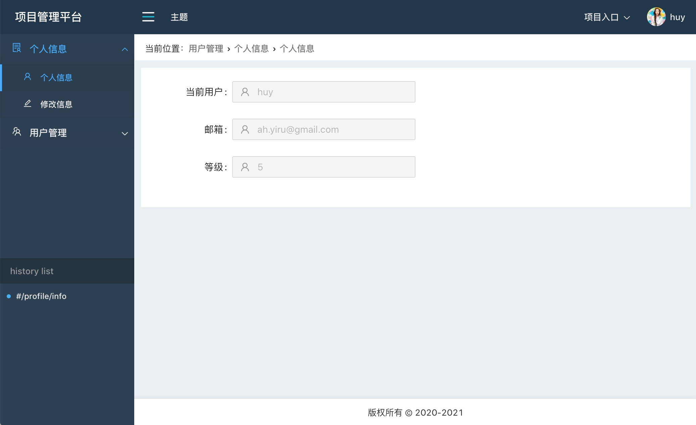

## 自定义配置layout

### 主题配置

自定义主题配置。

`config.css`

```
.frame{
  /* size */
  --maxWidth:100%;
  --menuWidth:200px;
  --headerHeight:52px;
  --footerHeight:40px;
  --collapseWidth:50px;
  --collapseMenuWidth:160px;
  --topbarHeight:0px;
  --breadHeight:40px;
  /* color */
  --bannerBgColor:#21364a;
  --navBgColor:#21364a;
  --menuBgColor:#2d4054;
  --deepMenuBgColor:hsla(0,0%,0%,.03);
  --appColor:#ffffff;
  --linkColor:#f0f0f0;
  --linkHoverColor:#40a9ff;
  --linkActiveColor:#40a9ff;
  --appBgColor:#eaeff2;
  --footerBgColor:#ffffff;
}
.frame.dark{
  /* size */
  --maxWidth:100%;
  --menuWidth:200px;
  --headerHeight:52px;
  --footerHeight:40px;
  --collapseWidth:50px;
  --collapseMenuWidth:160px;
  --topbarHeight:0px;
  --breadHeight:40px;
  /* color */
  --bannerBgColor:#21364a;
  --navBgColor:#21364a;
  --menuBgColor:#2d4054;
  --deepMenuBgColor:hsla(0,0%,0%,.03);
  --appColor:#ffffff;
  --linkColor:#f0f0f0;
  --linkHoverColor:#40a9ff;
  --linkActiveColor:#40a9ff;
  --appBgColor:#eaeff2;
  --footerBgColor:#ffffff;
}
.frame.dark1{
  /* size */
  --maxWidth:1200px;
  --menuWidth:220px;
  --headerHeight:50px;
  --footerHeight:45px;
  --collapseWidth:50px;
  --collapseMenuWidth:160px;
  --topbarHeight:0px;
  --breadHeight:40px;
  /* color */
  --bannerBgColor:#21364a;
  --navBgColor:#21364a;
  --menuBgColor:#2d4054;
  --deepMenuBgColor:hsla(0,0%,0%,.03);
  --appColor:#ffffff;
  --linkColor:#eeeeee;
  --linkHoverColor:#00b4cf;
  --linkActiveColor:#00b4cf;
  --appBgColor:#f3f3f3;
  --footerBgColor:#ffffff;
}
.frame.light{
  /* size */
  --maxWidth:100%;
  --menuWidth:220px;
  --headerHeight:50px;
  --footerHeight:45px;
  --collapseWidth:50px;
  --collapseMenuWidth:160px;

  --topbarHeight:0px;
  --breadHeight:40px;
  /* size */
  --bannerBgColor:#fcfcfc;
  --navBgColor:#ffffff;
  --menuBgColor:#fcfcfc;
  --deepMenuBgColor:hsla(0,0%,0%,.03);
  --appColor:#333333;
  --linkColor:#444444;
  --linkHoverColor:#3498db;
  --linkActiveColor:#3498db;
  --appBgColor:#f3f3f3;
  --footerBgColor:#ffffff;
}

```

`config.less`

```
@import "./config.css";

@maxWidth:var(--maxWidth);
@menuWidth:var(--menuWidth);
@headerHeight:var(--headerHeight);
@topbarHeight:var(--topbarHeight);
@footerHeight:var(--footerHeight);
@breadHeight:var(--breadHeight);
@collapseWidth:var(--collapseWidth);
@collapseMenuWidth:var(--collapseMenuWidth);

@bannerBgColor:var(--bannerBgColor);
@navBgColor:var(--navBgColor);
@menuBgColor:var(--menuBgColor);
@deepMenuBgColor:var(--deepMenuBgColor);
@appColor:var(--appColor);
@linkColor:var(--linkColor);
@linkHoverColor:var(--linkHoverColor);
@linkActiveColor:var(--linkActiveColor);
@appBgColor:var(--appBgColor);
@footerBgColor:var(--footerBgColor);

@containerHeight:calc(100vh - @headerHeight - @footerHeight - @breadHeight);

```

### layout设计

一般系统平台layout框架，包含头部、底部、侧边栏、设置栏、内容区域、面包屑等。

`layout.jsx`

```
<div className={`frame ${theme}`}>
  <header className="frame-header">
    <Header {...props} menu={navMenu} collapseMenu={collapseMenu} theme={theme} switchTheme={switchTheme} />
  </header>
  <main className="frame-main">
    <Main {...props} showMenu={showMenuCls} menu={sideMenu} />
  </main>
  <footer className={`frame-footer${showMenuCls}`}>
    <Footer />
  </footer>
</div>

```
`main.jsx`

```
const breadcrumb=current=><div className="breadcrumb">
  <span style={{float:'left'}}>当前位置： </span>
  <ul>
    {current.filter(v=>v.name).map(v=>v.path!=='/'&&<li key={v.path}><Link to={v.path}>{v.name}</Link></li>)}
  </ul>
</div>;

const Main=props=>{
  const {current,children,showMenu}=props;
  return <div className="frame-container">
    <div className={`frame-view${showMenu}`}>
      <div className="page-container">
        {breadcrumb(current)}
        <div className="content">
          {children}
        </div>
      </div>
    </div>
  </div>;
};

```

我们可以根据需求来自定义layout，如横纵菜单切换或组合，sidebar添加自定义挂件，自定义设置栏等。

### 响应式布局

可根据需求自己设计不同终端下的不同布局。

```
@media screen and (max-width:env(--viewport-app)){
  .frame{
    .frame-main{
      .frame-container{
        .frame-aside{
          left:0;
        }
      }
    }
  }
}

@media screen and (max-width:1024px){
  .frame{
    .frame-main{
      .frame-container{
        .frame-aside{
          width:0;
          &.showMenu{
            width:@menuWidth;
          }
        }
        .frame-view{
          padding-left:0;
          &.showMenu{
            padding-left:0;
          }
        }
      }
    }
    .frame-footer{
      .footer{
        padding-left:0;
      }
      &.showMenu{
        .footer{
          padding-left:0;
        }
      }
    }
  }
}

```




